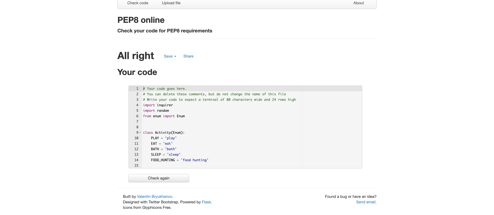
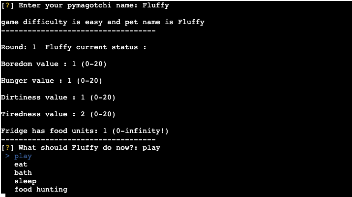

# Pymagotchi

## About
Pymagotchi is a terminal game programed with Python, which runs in the Code Institute mock terminal on Heroku.

[Tamagotchi](https://en.wikipedia.org/wiki/Tamagotchi) is a funny and a widely-known game in which the goal 
is to take care of small creature called Tamagotchi in these project from now on known as Pymagotchi
(Because it's created with python. That's a pun. I am trying to be funny here.)
How long will creature survive depends on our decision and luck.

[Click here to try out the live game/project.](https://pymagotchi.herokuapp.com/)

## User Experience

I aimed to create a story generator game for children that is fun and is very easy to manipulate and input data.

### The ideal client:
- Middle age person
- Had Tamagotchi when was I child
- Children who want to have a pet

### The game will help clients to:
- Remind of a childhood
- Test their parenting skill
- Get them familiar with terminal console and how to navigate it.
- Provide entertainment

## User Stories

1. As a user, I want to easily navigate through terminal options.
2. As a user, I want game to be fun.
3. As a user, I want to be able to finish the game during one session.
4. As a user, I want to have different difficulty levels.
5. As a user, I want to name my pymagotchi.
6. As a user, I want to know how many rounds has my pymagotchi survived and compare that with friends scores.

## Owner Stories

1. As the owner, I want the game to be fun and make the user returning.
2. As the owner, I want the game to remind older players theirs childhood and bring back emotion from that period.
3. As the owner, I want game to not be too long soo I don't have to implement save/load functionality.
4. As the owner, I want to secure correct way to play this game.

## Features
### Existing Features
- 3 Difficulty levels
- Pymagotchi naming
- 5 activities to choose from.
- RNG - random impact on pet stats each turn.
- Round counting

### Future features
- Top 10 high scores board
- Random event that might occur each turn. Like for ex. each turn there would be 10% chance to something unexpected happen.
- Gaining experience/levels , choosing perks to  help pymagotchi stay alive longer.
- Graphical images of creature created in terminal

## Testing

### 1. [pep8online.com](http://pep8online.com/) result

### 2. Manual testing results

- Thanks to 'Inquirer' library possible user input errors are minimized
- Name input for Pymagatochi is validated by use of isalpha() method which secures that input value can be only letters
- Difficulty levels accept 3 correct values. If somehow user managed to provide other value there is easter egg provided in code.

### Summary
- during manual testing didn't manage to find any bugs that could impact user experience.
- 'Inquirer' library provides great user experience for terminal app.

## Technology Used

- [Github](https://github.com) - as source control
- [Heroku](https://heroku.com) - deploying platform
- [PyCharm](https://www.jetbrains.com/pycharm/) - IDE of choice for working with python
- [PEP8online](http://pep8online.com/) - To validate my code and check for errors

## Deployment
The project was developed using PyCharm and was deployed via the GitHub repository to Heroku.

The following steps were done to deploy this project:

1. From the Heroku dashboard, select 'New' in the top right-hand corner.
2. Click 'Create new app'.
3. Enter the app name and choose region.
4. Click 'Create app'.
5. Choose Deployment method. In my case GitHub.
6. Choose correct repository with Pymagotchi
7. Enable Automatic Deploys
8. Go to Settings
9. Click Add buildpack
10. Choose Python then Save changes
11. Repeat click add buildpack, choose Nodejs
12. Go to Deploy
13. Section 'Manual deploy', choose you main/master branch, press 'Deploy branch'
14. Wait for build to finish (Grab a coffee or something)
15. Press 'Open app' in right top corner and have fun!

## Credits

- My [wife](https://disney.fandom.com/wiki/Madame_Medusa) ( <-- it's a trap) to give me inspiration to make Pymagotchi/Tamagotchi game
- My mentor [Guido Cecilio](https://github.com/guidocecilio) for being soo helpful and also excited about the project idea. Plus showing me how useful Enum can be! Thanks Guido!
- 'Inquirer' library authors/contributors for creating such amazing and easy to use library.